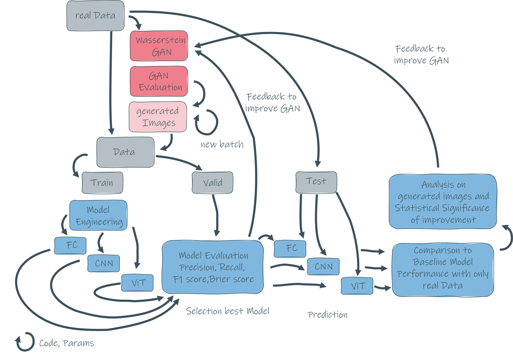
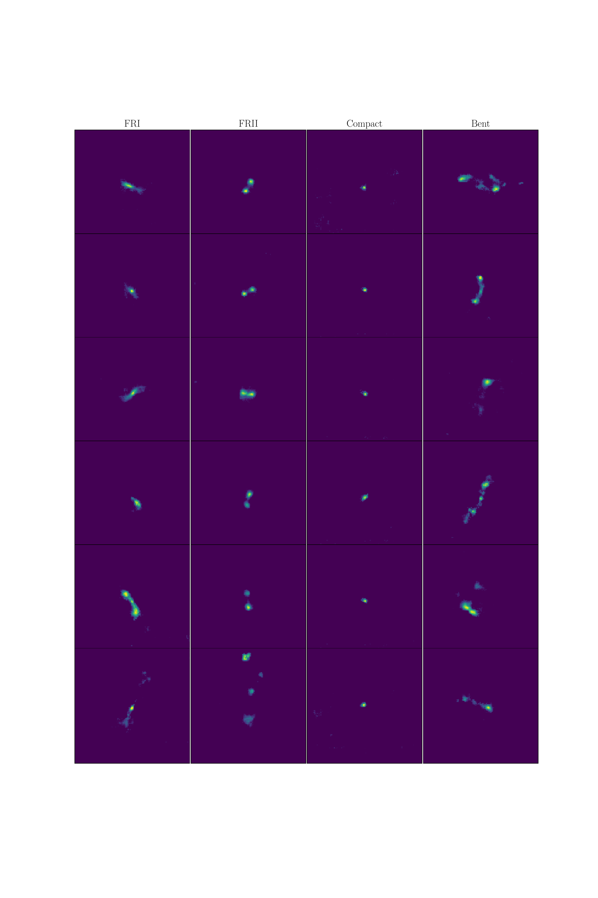

# Radio Galaxy with GANs and Classifier

## Galaxy class definition

## Prerequisite
It is necessary to have a Comet (https://www.comet.com/site/) account, in order to run the GAN training.
Export your CometML API key as an environment variable

`export COMET_EXPERIMENT_KEY=<YOURCOMETMLAPIKEY>`

## Install

`pip install -r requirements.txt`

## Usage GAN Training

`python3 wGANMain.py config/defaultConfig.yaml --EXP <YOUREXPERIMENTNAME> --comet_project_name wgan_training`

## Usage GAN Image generation with checkpoints

Open the `radio_galaxy_image_generator_notebook.ipynb` to generate radio galaxy image with pre-saved checkpoints.

Impression of the generated radio galaxy images
https://radiogalaxyimagegenerator.streamlit.app/

## Usage training FCN/CNN Classifiers with real and generated images

`python3 run_augmented_classifier_training.py <n_iterations> <lambda_gen>` 

## Usage training Vit Classifier with real and generated images
Change the parameter in `ViT_pytorch_parameters.json` to adjust the training hyperparameters 
and select your cross-validation set with `x_val_index`.

`python3 run_train.py --params_file ViT_pytorch_parameters.json --x_val_index 1 --api_key <YOURCOMETMLAPIKEY>`

## Usage prediction Vit Classifier with real and generated images
When you have trained the Vit classifier with all `x_val_index`, you can run the `predict.py` for all `x_val_index` in one run with

`python3 run_predict.py`

## Examples generared radio galaxy images

If you find the generated radio galaxy images useful, please cite:

`@misc{rustige_morphological_2022,
	title = {Morphological Classification of Radio Galaxies with {wGAN}-supported Augmentation},
	url = {http://arxiv.org/abs/2212.08504},
	doi = {10.48550/arXiv.2212.08504},
	number = {{arXiv}:2212.08504},
	publisher = {{arXiv}},
	author = {Rustige, Lennart and Kummer, Janis and Griese, Florian and Borras, Kerstin and Brüggen, Marcus and Connor, Patrick L. S. and Gaede, Frank and Kasieczka, Gregor and Knopp, Tobias and Schleper, Peter},
	urldate = {2022-12-19},
	date = {2022-12-16},
	eprinttype = {arxiv},
	eprint = {2212.08504 [astro-ph]}
}`
