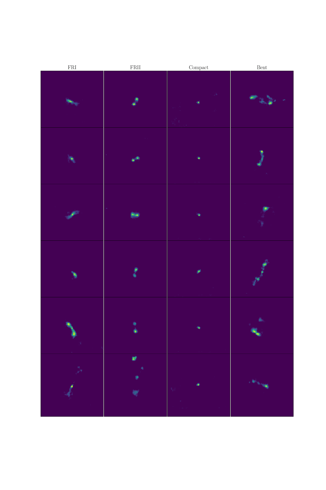
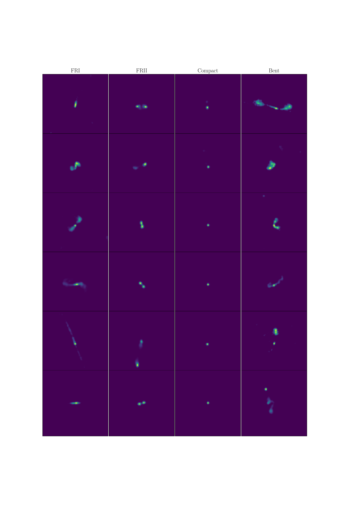

# Morphological Classification of Radio Galaxies with wGAN-supported Augmentation

## Impression of the generated radio galaxy images 
https://radiogalaxyimagegenerator.streamlit.app/

## Install dependencies
`pip install -r requirements.txt`

## Start Jupiter notebook
`jupyter notebook`

## Open and execute
`radio_galaxy_image_generator_notebook.ipynb`

## Examples generared radio galaxy images

## Examples real radio galaxy images

If you find the generated radio galaxy images useful, please cite:

`@misc{rustige_morphological_2022,
	title = {Morphological Classification of Radio Galaxies with {wGAN}-supported Augmentation},
	url = {http://arxiv.org/abs/2212.08504},
	doi = {10.48550/arXiv.2212.08504},
	number = {{arXiv}:2212.08504},
	publisher = {{arXiv}},
	author = {Rustige, Lennart and Kummer, Janis and Griese, Florian and Borras, Kerstin and Brüggen, Marcus and Connor, Patrick L. S. and Gaede, Frank and Kasieczka, Gregor and Knopp, Tobias and Schleper, Peter},
	urldate = {2022-12-19},
	date = {2022-12-16},
	eprinttype = {arxiv},
	eprint = {2212.08504 [astro-ph]}
}`

